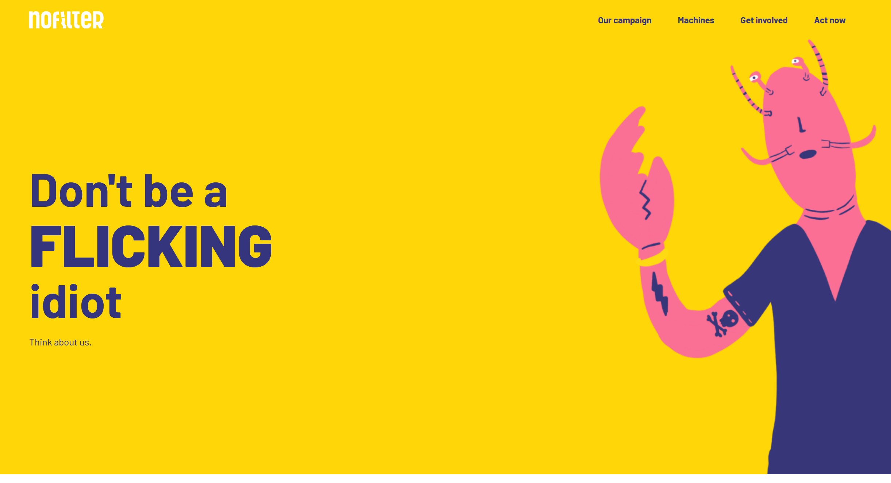
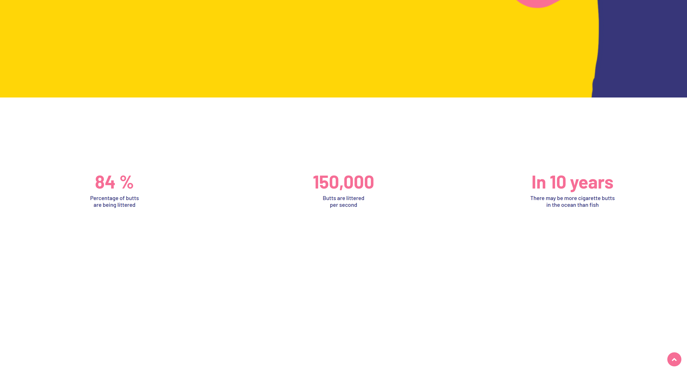
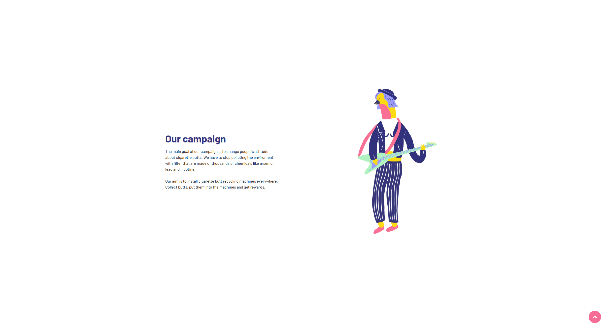
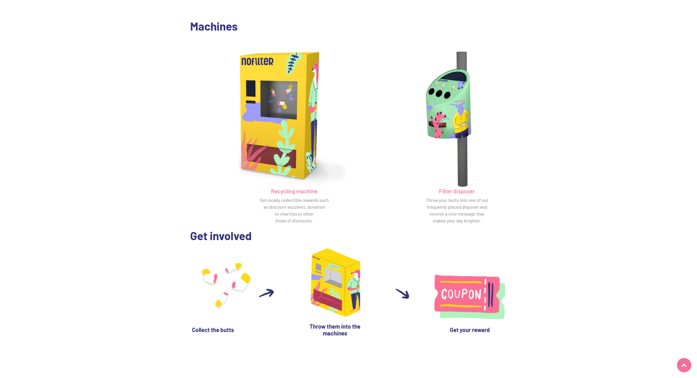
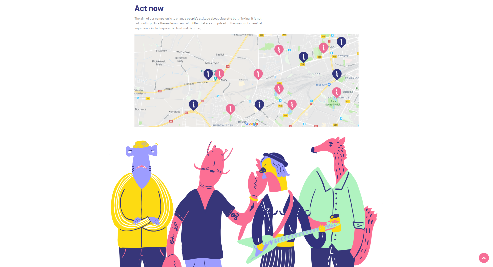

# HackYeah-PhilipMorris-2019

We were on HackYeah 2019 at Warsaw in Polland. This a competition where you can pick up a task from a company and you got 24 hours to complete it. Here is our project.

## Concept

The concept is about a campaign to motivate people to collect the cigarette stubs instead of throwing them away.

## Screenshots

## Team members

UX designer - Szilvás Anett 
graphic designer - Molnár Roland 
graphic designer- Matyikánics Ádám 
developer - Gajdár Krisztián  
developer - Lázár Dávid 

## Links

HackYeah - https://hackyeah.pl/
Original repository - https://github.com/ame307/HackYeah-PhilipMorris
